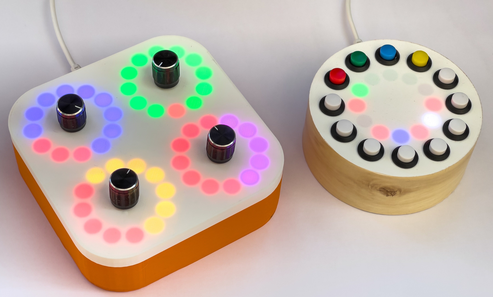

## PICO MIDI Crackers Controller
Designs and software for a MIDI controller described in HackSpace magazine. 

The PICO MIDI Crackers controller uses four rotary inputs and four pixel rings to create a programmable MIDI controller. It is programmed in Circuit Python.

You can find the program in the code folder. The software is written in Circuit Python which version 7.0 can be installed on your Raspberry PI PICO using the image from here: https://circuitpython.org/downloads. It uses the Adafruit adafruit_bus_device and adafruit_midi libraries which need to be copied into the lib folder on the Circuit Python drive of your PICO. You can find these here: https://circuitpython.org/libraries. 
## MIDI
The controller outputs control changed messages on MIDI channel 1. The control numbers used start at 21. An updated value is sent each time a control is moved. There are four sets of control settings, blue, yellow, green and magenta. Toggle between the settings by pressing down the knob of any controller. 

- blue controls 21,22,23,24
- yellow controls 25,26,27,28
- green controls 29,30,31,32
- magenta controls 33,34,35,36

## Pure Data
The patches folder contains the Pure Data patches and resources for the synthesizer. Open the "CheeseSynth" patch with Pure Data.