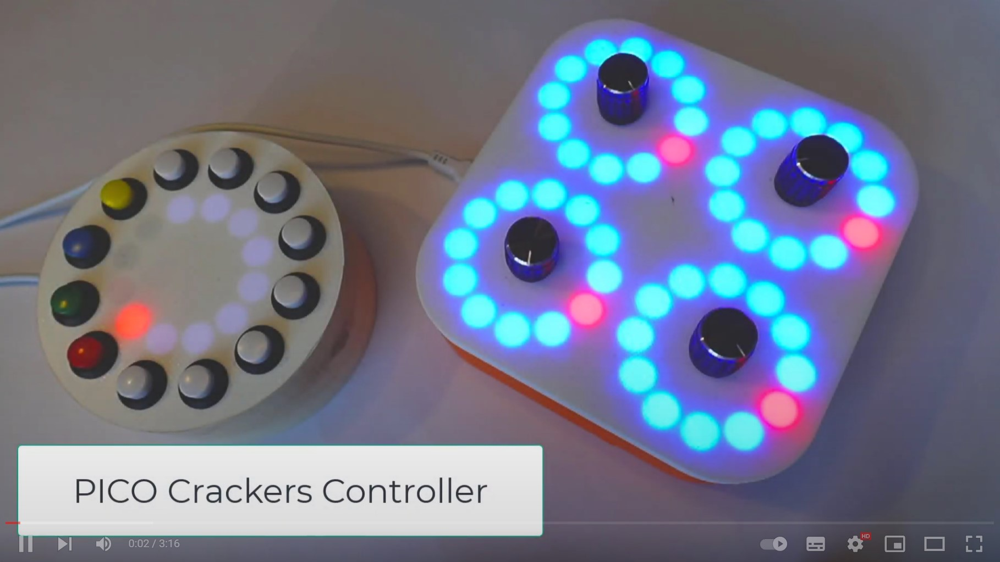
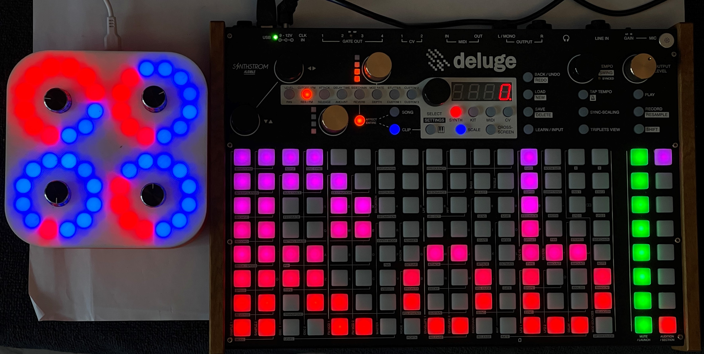

## PICO MIDI Crackers Controller
Designs and software for a MIDI controller described in HackSpace magazine. 


The PICO MIDI Crackers controller uses four rotary inputs and four pixel rings to create a programmable MIDI controller. It is programmed in Circuit Python.
## Video
[](https://youtu.be/vI_cmTigS_Q)

To find out more about the device click on the image above to see a short video.
You can find the program in the code folder. 
## Construction
The software is written in Circuit Python which version 7.0 can be installed on your Raspberry PI PICO using the image from here: https://circuitpython.org/downloads. It uses the Adafruit adafruit_bus_device and adafruit_midi libraries which need to be copied into the lib folder on the Circuit Python drive of your PICO. You can find these here: https://circuitpython.org/libraries. 
### Connections
Check the code for the GPIO connections for the rotary encoder. You can see it below, it starts on line 213 in the main.py file.
```
self.controllers = [
    MidiController(client=self, name="c1", encoder_pin1=board.GP8, encoder_pin2=board.GP9, pulses_rev=20,
                   button_pin=board.GP14, pixel_start=24, no_of_pixels=12, forward=True, pixel_offset=2,
                   configs=c1),
    MidiController(client=self, name="c2", encoder_pin1=board.GP10, encoder_pin2=board.GP11, pulses_rev=20,
                   button_pin=board.GP15, pixel_start=36, no_of_pixels=12, forward=True, pixel_offset=-1,
                   configs=c2),
    MidiController(client=self, name="c3", encoder_pin1=board.GP6, encoder_pin2=board.GP7, pulses_rev=20,
                   button_pin=board.GP17, pixel_start=12, no_of_pixels=12, forward=True, pixel_offset=5,
                   configs=c3),
    MidiController(client=self, name ="c4", encoder_pin1=board.GP4, encoder_pin2=board.GP5, pulses_rev=20,
                   button_pin=board.GP12, pixel_start=0, no_of_pixels=12, forward=False, pixel_offset=8,
                   configs=c4)
    ]
```
You can change the GPIO values to match your hardware configuration.
## MIDI
The controller outputs control changed messages on MIDI channel 1. The control numbers used start at 21. An updated value is sent each time a control is moved. There are four sets of control settings, blue, yellow, green and magenta. Toggle between the settings by pressing down the knob of any controller. 

- blue controls 21,22,23,24
- yellow controls 25,26,27,28
- green controls 29,30,31,32
- magenta controls 33,34,35,36

## Pure Data
The patches folder contains the Pure Data patches and resources for the synthesizer. Open the "CheeseSynth" patch with Pure Data.
# Devices
You can use the controller with lots of devices....
## Synthstrom Deluge

The [Synthstrom Deluge](https://synthstrom.com/product/deluge/) is an awesome synthesizer, sampler and sequencer. 

You can connect the Crackers Controller directly to a Deluge. You'll need a "Type A Female to USB B Male Scanner Printer Extension Adapter Cable" that will let you plug the USB cable from the controller into the Deluge. You will also have to make sure that the Deluge is powered from a mains adapter. 

You use the MIDI learn feature of the Deluge to assign controller outputs to setting values:

* Go to the MIDI, Synth or sample clip that you want to use with the controller.
* Find a setting for the clip that you want to control. I like playing with the value of Bitcrush (7 from the left and 1 down).
* Hold down the SHIFT key and press the setting button (perhaps Bitcrush) you want to control.  This should make the setting button flash and the current value of the setting is shown in the four digit display. You can now change that settign by twiddling the black select knob in the middle of the Deluge.
* To assign one of the controller knobs to this setting press and hold the Learn button. and twiddle the knob on the Crackers Controller. The four digit display will show "LEAr" to indicate that the control has been learned.
* Now when you twiddle the knob on the Crackers Controller you should see the value in the display changing. 
* The controller assignments are saved as part of the song data so they will be restored when you reload the song. 

Some settings can't be controlled over MIDI. If you try to control one of these you will see the word "Cant" displayed when you press the Learn button.

Remember that you have four different banks of setting values, change between the banks by pressing in any of the knobs on the controller. If you want to control a particular setting from multiple banks you can do this by using learn multiple times for that setting. 
